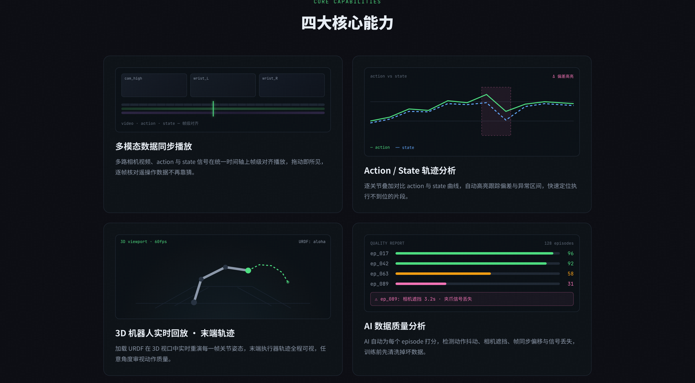

# LeRobot Viewer

**[中文](README.zh-CN.md) | English**

A desktop application for visualizing [LeRobot](https://github.com/huggingface/lerobot) datasets locally. Inspect robot episodes with synchronized video playback, joint state / action curves, and a URDF-driven 3D robot — all from local files, no server required.



## Why this exists

If you already use [Foxglove Studio](https://foxglove.dev/) or [Rerun](https://rerun.io/), you know the space. LeRobot Viewer is narrower: it targets the **specific shape of a Hugging Face LeRobot dataset** and does exactly the four things you need on that data.

- **Foxglove Studio** — general robotics stack, MCAP-native, plugin ecosystem. Overkill if all you have is a LeRobot Parquet + video folder.
- **Rerun** — great time-series viewer, requires you to log via their SDK. LeRobot Viewer reads the on-disk format directly.
- **LeRobot Viewer** — opinionated for LeRobot's exact layout (`meta/info.json` + `data/chunk-*/…parquet` + `videos/…/*.mp4`). Open a folder, get a viewer.

## Features

### Multimodal synchronized playback
Multi-camera video, action, and state signals aligned frame-by-frame on a single timeline. Drag to scrub; step through teleoperation data without guessing.

### Action / state trajectory analysis
Overlay action vs. state curves per joint. Interactive tooltip; click-to-seek on the chart; per-joint filter.

### 3D robot playback
Load a URDF and replay every joint pose in real time inside a 3D viewport. Hover a link to inspect its parent joint / mass metadata.

## Packages

| Package | Description |
|---------|-------------|
| [`@lerobot-viewer/player`](./packages/player) | React + Three.js multimodal playback SDK |
| [`@lerobot-viewer/reader`](./packages/reader) | Node.js Parquet reader for LeRobot datasets |

Both packages are consumable independently — you can use `@lerobot-viewer/player` in your own web app if you supply your own `EpisodeFrame[]`.

## Requirements

- Node.js ≥ 20
- pnpm ≥ 9

## Getting started

```bash
git clone https://github.com/zhemuse/lerobot-viewer.git
cd lerobot-viewer
pnpm install
pnpm dev
```

## Build

```bash
pnpm build           # build the desktop app for the current platform
pnpm build:packages  # build the two npm packages
pnpm typecheck
pnpm test
pnpm lint
```

## Project structure

```
lerobot-viewer/
├── apps/
│   └── lerobot-viewer/    # Electron desktop app
└── packages/
    ├── player/            # @lerobot-viewer/player
    └── reader/            # @lerobot-viewer/reader
```

## Roadmap

- HuggingFace Hub dataset source (fetch without cloning locally)
- Multi-window dataset comparison
- Automated data-quality report (motion jitter, camera occlusion, sync drift, signal loss)
- Signed macOS/Windows/Linux release builds with auto-update

## License

MIT
